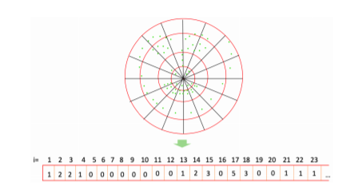

# Spider-Gender
In this project we are using a Linear SVM Classifier to predict a person gender by using a feature vector generated from a Web Shaped Model.

For further information look at the paper and the PowerPoint presentation.

The datasets used:
* CelebA: https://www.kaggle.com/jessicali9530/celeba-dataset
* UTKFace: https://www.kaggle.com/jangedoo/utkface-new
